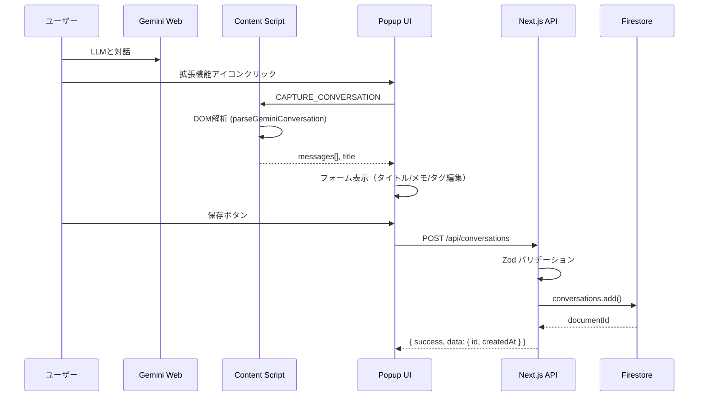
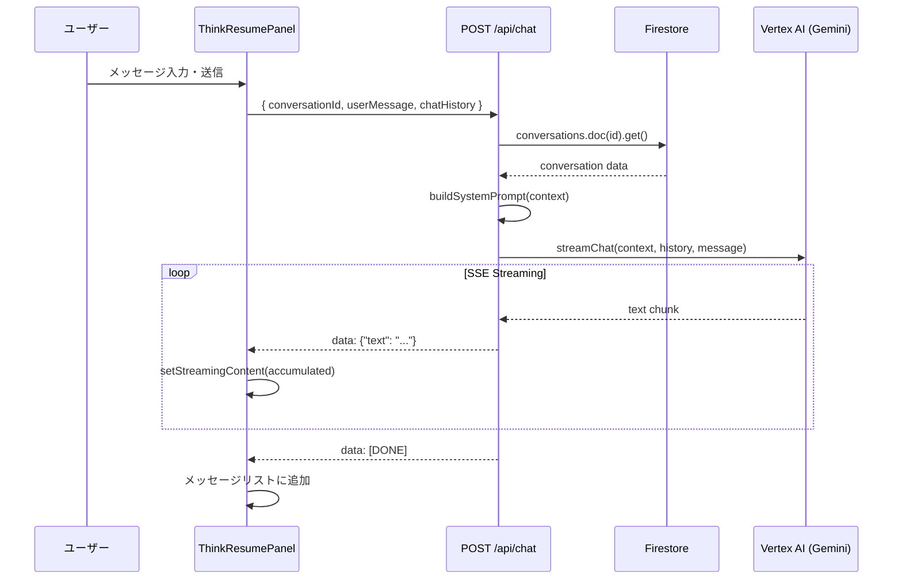
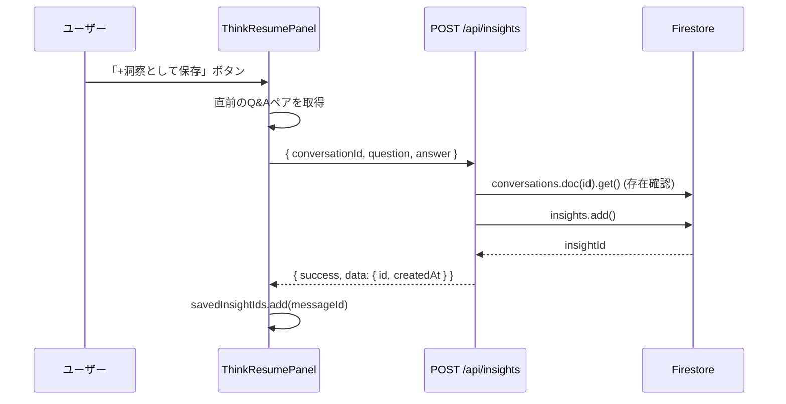
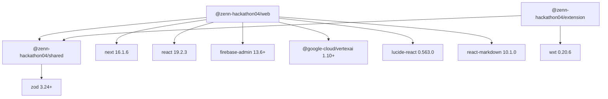

# アーキテクチャ

本ドキュメントは、ThinkResumeの設計判断（ADR-lite）、コンポーネント構成、データフローを記録する。
設計方針の「なぜ」を可視化し、将来の拡張・保守時の判断基準とする。

## 設計方針

本プロジェクトは **SOLID原則** を基盤とする（`doc/input/architecture.md` より）:

- **SRP**: 各モジュールは単一責務（パーサー、API、UIコンポーネント分離）
- **OCP**: プラットフォーム追加時に既存パーサーを変更せず拡張可能
- **LSP**: `ConversationParser` インターフェースで代替可能性を保証
- **ISP**: 共通型を最小限に保ち、利用側に不要な依存を強要しない
- **DIP**: Firebase Admin SDK は `getDb()` 関数で抽象化

追加の設計方針:
- **Server Components 優先**: Next.js App Router のServer Componentsをデフォルトとし、状態管理が必要なコンポーネントのみClient Component化
- **Zod SSOT**: 型定義をZodスキーマで一元管理し、バリデーションと型推論を統合
- **GCP統一**: Firestore + Vertex AI + (将来)Cloud Run でインフラを一本化

## コンポーネント図

```mermaid
graph TB
    subgraph "Chrome Extension"
        CS[Content Script]
        BG[Background Script]
        PU[Popup UI]

        subgraph "Parsers"
            GP[Gemini Parser]
            CP["ChatGPT Parser (stub)"]
            CLP["Claude Parser (stub)"]
        end
    end

    subgraph "Web Application"
        subgraph "API Routes"
            API_LIST["GET /api/conversations"]
            API_SAVE["POST /api/conversations"]
            API_GET["GET /api/conversations/:id"]
            API_PATCH["PATCH /api/conversations/:id"]
            API_CHAT["POST /api/chat (SSE)"]
            API_INSIGHT_SAVE["POST /api/insights"]
            API_INSIGHT_LIST["GET /api/conversations/:id/insights"]
        end

        subgraph "Server Components"
            PAGE_LIST["対話一覧 page.tsx"]
            PAGE_DETAIL["対話詳細 page.tsx"]
        end

        subgraph "Client Components"
            DETAIL_CONTENT["ConversationDetailContent"]
            NOTE["NoteSection (Optimistic Update)"]
            CHAT["ThinkResumePanel (SSE Stream)"]
            INSIGHT["InsightSection"]
            SIDEBAR["Sidebar"]
        end

        subgraph "Lib"
            FB["Firebase Admin"]
            VX["Vertex AI (Gemini)"]
            ERR["Error Handler"]
            DATE["Date Utils"]
            UNSAVED["useUnsavedChangesWarning"]
        end
    end

    subgraph "Shared Package"
        SCHEMA["Zod Schemas<br/>(conversation, api, insight)"]
    end

    subgraph "External"
        FS[(Firestore)]
        GEMINI_WEB["Gemini Web"]
        VA["Vertex AI"]
    end

    CS --> GP
    GP --> GEMINI_WEB
    PU --> API_SAVE

    API_SAVE --> FB
    API_LIST --> FB
    API_GET --> FB
    API_PATCH --> FB
    API_CHAT --> VX
    API_CHAT --> FB
    API_INSIGHT_SAVE --> FB
    API_INSIGHT_LIST --> FB
    FB --> FS
    VX --> VA

    PAGE_LIST --> API_LIST
    PAGE_DETAIL --> API_GET
    NOTE --> API_PATCH
    CHAT --> API_CHAT
    CHAT --> API_INSIGHT_SAVE
    INSIGHT --> API_INSIGHT_LIST

    API_SAVE --> SCHEMA
    API_GET --> SCHEMA
    CS --> SCHEMA
    PU --> SCHEMA
    NOTE --> UNSAVED
```



## レイヤー構成

```
┌─────────────────────────────────────────────────────────────┐
│                    Presentation Layer                        │
│  ┌─────────────────┐  ┌─────────────────────────────────┐  │
│  │ Chrome Extension │  │ Next.js Pages (App Router)      │  │
│  │ - Popup UI       │  │ - page.tsx (一覧) [Server]      │  │
│  │ - Content Script │  │ - conversations/[id] [Server]   │  │
│  └─────────────────┘  │ - NoteSection [Client]          │  │
│                        │ - ThinkResumePanel [Client]     │  │
│                        │ - InsightSection [Client]       │  │
│                        │ - Sidebar [Client]              │  │
│                        └─────────────────────────────────┘  │
├─────────────────────────────────────────────────────────────┤
│                    Application Layer                         │
│  ┌─────────────────┐  ┌─────────────────────────────────┐  │
│  │ Parsers          │  │ API Routes                      │  │
│  │ - gemini.ts      │  │ - POST/GET /api/conversations   │  │
│  │ - index.ts       │  │ - GET/PATCH /api/conversations/:id │
│  └─────────────────┘  │ - POST /api/chat (SSE)          │  │
│                        │ - POST /api/insights            │  │
│                        │ - GET /.../insights             │  │
│                        └─────────────────────────────────┘  │
├─────────────────────────────────────────────────────────────┤
│                    Domain Layer                              │
│  ┌─────────────────────────────────────────────────────┐   │
│  │ packages/shared                                      │   │
│  │ - ConversationSchema, MessageSchema                  │   │
│  │ - InsightSchema                                      │   │
│  │ - ApiSuccessSchema, ApiFailureSchema                 │   │
│  │ - SaveInsightRequestSchema, UpdateConversationSchema │   │
│  └─────────────────────────────────────────────────────┘   │
├─────────────────────────────────────────────────────────────┤
│                    Infrastructure Layer                      │
│  ┌─────────────────┐  ┌────────────────┐  ┌─────────────┐ │
│  │ Firebase Admin   │  │ Vertex AI      │  │ WXT Runtime │ │
│  │ - admin.ts       │  │ - gemini.ts    │  │ - browser.* │ │
│  │ - getDb()        │  │ - types.ts     │  │             │ │
│  └─────────────────┘  └────────────────┘  └─────────────┘ │
└─────────────────────────────────────────────────────────────┘
```

## データフロー

### 対話キャプチャフロー



### 思考再開フロー（Sprint 2 追加）



### 洞察保存フロー（Sprint 2 追加）



## 設計判断（ADR-lite）

### ADR-001: モノレポ構成（pnpm workspaces）

- **決定**: pnpm workspaces でモノレポ構成を採用
- **理由**: Hackathon規模でシンプル、型共有が容易
- **代替案**: npm workspaces, Turborepo, Nx
- **トレードオフ**: 大規模化時にビルド最適化が必要になる可能性

### ADR-002: 共通スキーマの分離（packages/shared）

- **決定**: Zodスキーマを `packages/shared` に分離
- **理由**: 拡張機能↔Web API間の型安全性を保証、バリデーション統一
- **代替案**: 各アプリで個別に型定義
- **トレードオフ**: パッケージ依存が増えるが、型不整合リスクが大幅減少

### ADR-003: DOM解析セレクタの定数化

- **決定**: `GEMINI_SELECTORS` として定数化（`apps/extension/lib/parsers/gemini.ts`）
- **理由**: LLMサイトのDOM構造変更に迅速対応可能
- **代替案**: ハードコーディング
- **トレードオフ**: 抽象化コスト vs 保守性向上

### ADR-004: Firebase Admin SDK のサーバーサイド専用

- **決定**: Firebase Admin SDK はサーバーサイド（API Routes）でのみ使用
- **理由**: API Keyの露出防止、サービスアカウント認証による強固なセキュリティ
- **代替案**: クライアントサイドFirebase SDK
- **トレードオフ**: クライアント→サーバー→Firestoreの経路が増えるが、セキュリティ優先

### ADR-005: SSE（Server-Sent Events）によるストリーミング（Sprint 2）

- **決定**: Gemini対話レスポンスをSSEで逐次送信
- **理由**: WebSocketsより軽量、HTTP/2対応、Next.js API Routesと親和性が高い
- **代替案**: WebSocket、ポーリング
- **トレードオフ**: 単方向のみ（サーバー→クライアント）だが、チャット用途では十分

### ADR-006: Optimistic Update（メモ編集、Sprint 2）

- **決定**: UIを先に更新し、バックグラウンドでAPI保存。失敗時ロールバック
- **理由**: UX向上（保存ボタン→即座に反映、待ち時間ゼロ）
- **代替案**: 保存完了まで待機（Pessimistic Update）
- **トレードオフ**: ロールバック処理が必要。ネットワーク切断時にユーザーが混乱する可能性

### ADR-007: ナビゲーションガード（Sprint 2）

- **決定**: `beforeunload` + クリックキャプチャ + `popstate` の3層ガード
- **理由**: Next.js App Routerにはナビゲーションガード機能が未提供
- **代替案**: React Router（App Router非互換）、ルーター変更監視（非公開API依存）
- **トレードオフ**: ハック的実装だが、全離脱パターンをカバー。`router.push`は未対応（Issue #36）

### ADR-008: カーソルベースのページネーション

- **決定**: Firestoreの`startAfter()`を使ったカーソル方式
- **理由**: オフセット方式はFirestoreで非効率（全ドキュメント読み取り）
- **代替案**: オフセットベース、`limit`のみ
- **トレードオフ**: 任意ページへのジャンプ不可だが、「次を読み込む」UIでは問題なし

## 依存関係

### 外部サービス

| サービス | 用途 | 依存度 |
|---------|------|--------|
| Firestore | 対話・洞察データ永続化 | 高（コア機能） |
| Gemini Web | DOM解析対象 | 高（キャプチャ機能） |
| Vertex AI (Gemini 2.0 Flash) | 思考再開チャット | 高（Sprint 2で追加） |

### パッケージ間依存



## 次に読むべきドキュメント

- データ構造 → [database.md](database.md)
- APIインターフェース → [api.md](api.md)
- モジュール詳細 → [modules/](modules/)
