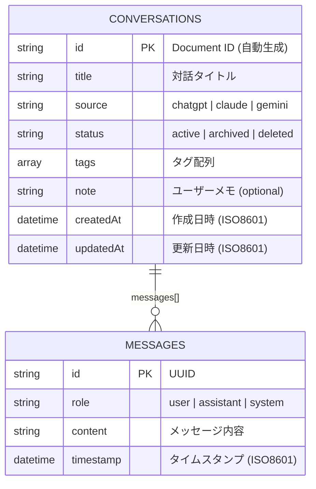

# データベース設計

## 概要

- **DB種別**: Firestore (NoSQL, Document-Oriented)
- **プロジェクト**: GCP上のFirebaseプロジェクト
- **認証**: Firebase Admin SDK（サービスアカウント）

## ER図



## コレクション定義

### conversations

Firestoreのルートコレクション。各ドキュメントが1つの対話セッションを表す。

| フィールド | 型 | 制約 | 説明 |
|-----------|-----|------|------|
| id | string | PK, 自動生成 | Document ID |
| title | string | 必須 | 対話タイトル（ユーザー設定 or 自動抽出） |
| source | string | 必須, enum | `'chatgpt'` \| `'claude'` \| `'gemini'` |
| messages | array | 必須 | Messageオブジェクトの配列 |
| status | string | 必須, enum | `'active'` \| `'archived'` \| `'deleted'` |
| tags | array | デフォルト [] | 文字列配列 |
| note | string | optional | ユーザーによるメモ |
| createdAt | string | 必須 | ISO 8601形式の日時 |
| updatedAt | string | 必須 | ISO 8601形式の日時 |

### messages（埋め込みドキュメント）

`conversations` ドキュメント内の `messages` フィールドに埋め込み。

| フィールド | 型 | 制約 | 説明 |
|-----------|-----|------|------|
| id | string | 必須 | メッセージ一意識別子（UUID） |
| role | string | 必須, enum | `'user'` \| `'assistant'` \| `'system'` |
| content | string | 必須 | メッセージ内容 |
| timestamp | string | 必須 | ISO 8601形式のタイムスタンプ |

## インデックス

### 自動インデックス（Firestoreデフォルト）

- 各フィールドに対する単一フィールドインデックス

### 複合インデックス（必要に応じて追加）

| 対象フィールド | 目的 |
|---------------|------|
| `updatedAt DESC` | 一覧取得時のソート |
| `status, updatedAt DESC` | ステータスフィルタ + ソート（将来） |

## クエリパターン

### 対話一覧取得

```typescript
db.collection('conversations')
  .orderBy('updatedAt', 'desc')
  .limit(PAGE_SIZE + 1)  // 次ページ判定のため +1
  .startAfter(cursorDoc) // カーソルページネーション
```

### 対話詳細取得

```typescript
db.collection('conversations').doc(id).get()
```

### 対話保存

```typescript
db.collection('conversations').add({
  ...data,
  status: 'active',
  createdAt: now,
  updatedAt: now,
})
```

## Zodスキーマ（packages/shared）

```typescript
// packages/shared/src/types/conversation.ts

export const MessageRoleSchema = z.enum(['user', 'assistant', 'system']);

export const MessageSchema = z.object({
  id: z.string(),
  role: MessageRoleSchema,
  content: z.string(),
  timestamp: z.string().datetime(),
});

export const ConversationStatusSchema = z.enum(['active', 'archived', 'deleted']);

export const SourcePlatformSchema = z.enum(['chatgpt', 'claude', 'gemini']);

export const ConversationSchema = z.object({
  id: z.string(),
  title: z.string(),
  source: SourcePlatformSchema,
  messages: z.array(MessageSchema),
  status: ConversationStatusSchema.default('active'),
  tags: z.array(z.string()).default([]),
  createdAt: z.string().datetime(),
  updatedAt: z.string().datetime(),
  note: z.string().optional(),
});
```

## データフロー

```mermaid
flowchart LR
    subgraph "Write Path"
        EXT[Chrome拡張] --> |POST| API[Web API]
        API --> |add()| FS[(Firestore)]
    end

    subgraph "Read Path"
        WEB[Web UI] --> |GET| API2[Web API]
        API2 --> |get()/query()| FS
        FS --> |Document| API2
        API2 --> |JSON| WEB
    end
```

## データ整合性

### バリデーション

- **保存時**: `SaveConversationRequestSchema.safeParse()` でZod検証
- **取得時**: 現在は型アサーション（将来的に `ConversationSchema.parse()` で再検証推奨）

### ID検証

```typescript
function isValidDocumentId(id: string): boolean {
  if (!id || id.length === 0 || id.length > 1500) return false;
  if (id.includes('/')) return false;
  if (id === '.' || id === '..') return false;
  if (/^__.*__$/.test(id)) return false;
  return true;
}
```

## 次に読むべきドキュメント

- APIインターフェース → [api.md](api.md)
- 設計判断の詳細 → [architecture.md](architecture.md)
