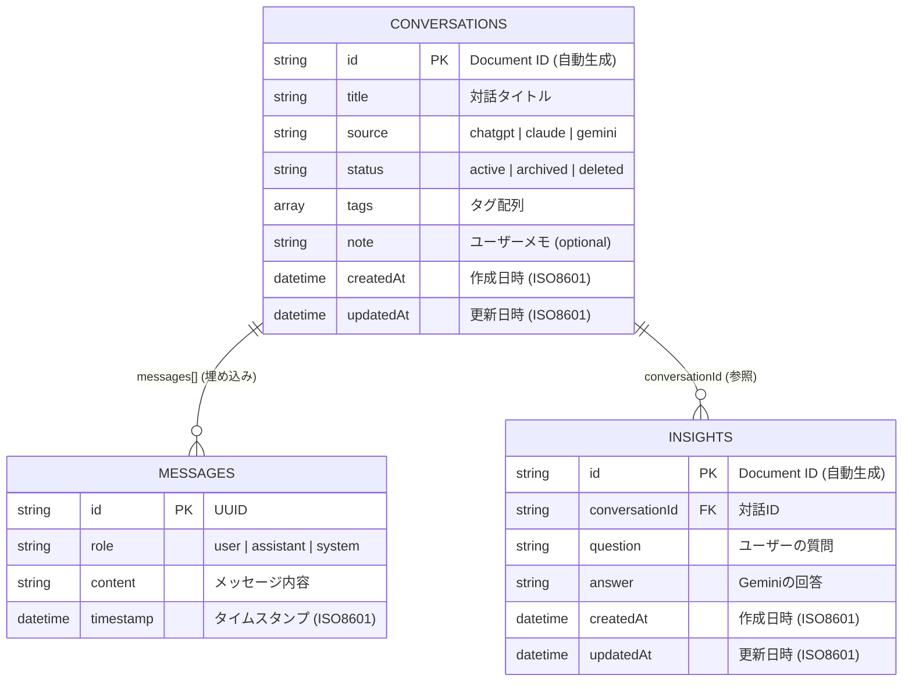
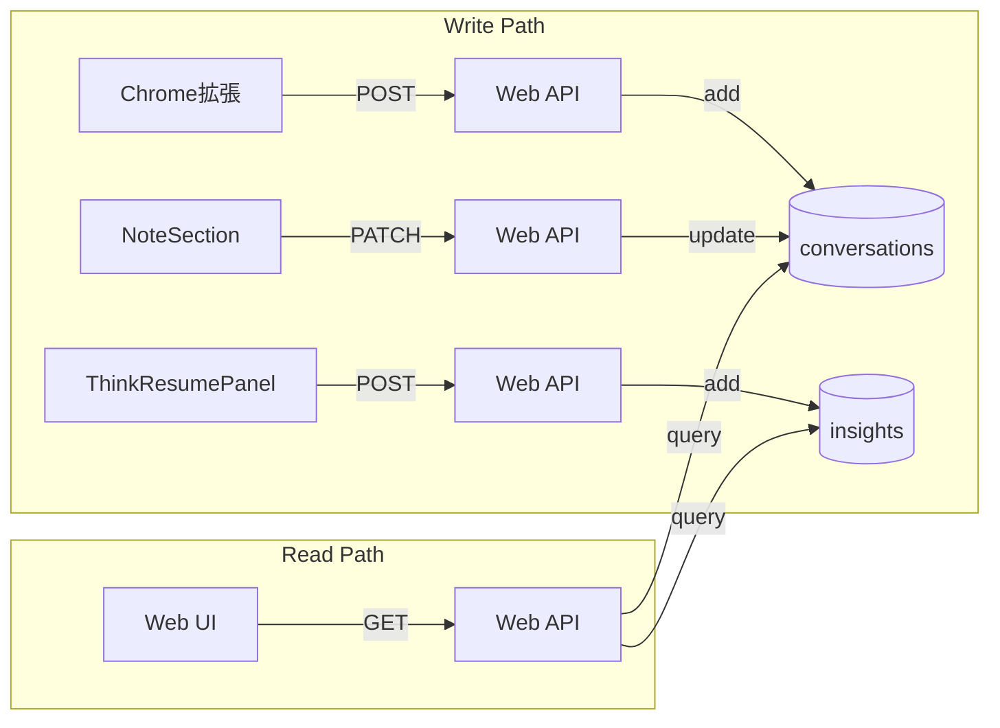

# データベース設計

本ドキュメントは、Firestoreのコレクション構造、ER図、クエリパターン、データ整合性ルールを記録する。
DB設計の全体像を把握し、新規コレクション追加やクエリ最適化の判断材料とする。

## 概要

- **DB種別**: Firestore (NoSQL, Document-Oriented)
- **プロジェクト**: GCP上のFirebaseプロジェクト
- **認証**: Firebase Admin SDK（サービスアカウント）

## ER図



## コレクション定義

### conversations

Firestoreのルートコレクション。各ドキュメントが1つの対話セッションを表す。

| フィールド | 型 | 制約 | 説明 |
|-----------|-----|------|------|
| id | string | PK, 自動生成 | Document ID |
| title | string | 必須 | 対話タイトル（ユーザー設定 or 自動抽出） |
| source | string | 必須, enum | `'chatgpt'` \| `'claude'` \| `'gemini'` |
| messages | array | 必須 | Messageオブジェクトの配列（埋め込み） |
| status | string | 必須, enum | `'active'` \| `'archived'` \| `'deleted'` |
| tags | array | デフォルト [] | 文字列配列 |
| note | string | optional | ユーザーによるメモ |
| createdAt | string | 必須 | ISO 8601形式の日時 |
| updatedAt | string | 必須 | ISO 8601形式の日時 |

### messages（埋め込みドキュメント）

`conversations` ドキュメント内の `messages` フィールドに埋め込み。

| フィールド | 型 | 制約 | 説明 |
|-----------|-----|------|------|
| id | string | 必須 | メッセージ一意識別子（UUID） |
| role | string | 必須, enum | `'user'` \| `'assistant'` \| `'system'` |
| content | string | 必須 | メッセージ内容 |
| timestamp | string | 必須 | ISO 8601形式のタイムスタンプ |

### insights（Sprint 2 追加）

Firestoreのルートコレクション。Geminiとの思考再開チャットから保存されたQ&Aペア。

| フィールド | 型 | 制約 | 説明 |
|-----------|-----|------|------|
| id | string | PK, 自動生成 | Document ID |
| conversationId | string | 必須, FK | 紐づく対話のID |
| question | string | 必須, max 10000 | ユーザーの質問 |
| answer | string | 必須, max 10000 | Geminiの回答 |
| createdAt | string | 必須 | ISO 8601形式の日時 |
| updatedAt | string | 必須 | ISO 8601形式の日時 |

## インデックス

### 自動インデックス（Firestoreデフォルト）

- 各フィールドに対する単一フィールドインデックス

### 複合インデックス（必要に応じて追加）

| 対象フィールド | 目的 |
|---------------|------|
| `updatedAt DESC` | 一覧取得時のソート |
| `status, updatedAt DESC` | ステータスフィルタ + ソート（将来） |
| `insights: conversationId, createdAt ASC` | 対話別の洞察一覧取得 |

## クエリパターン

### 対話一覧取得

```typescript
db.collection('conversations')
  .orderBy('updatedAt', 'desc')
  .limit(PAGE_SIZE + 1)  // 次ページ判定のため +1
  .startAfter(cursorDoc) // カーソルページネーション
```

### 対話詳細取得

```typescript
db.collection('conversations').doc(id).get()
```

### 対話保存

```typescript
db.collection('conversations').add({
  ...data,
  status: 'active',
  createdAt: now,
  updatedAt: now,
})
```

### メモ更新（Sprint 2 追加）

```typescript
db.collection('conversations').doc(id).update({
  note: newNote,
  updatedAt: now,
})
```

### 洞察保存（Sprint 2 追加）

```typescript
db.collection('insights').add({
  conversationId,
  question,
  answer,
  createdAt: now,
  updatedAt: now,
})
```

### 洞察一覧取得（Sprint 2 追加）

```typescript
db.collection('insights')
  .where('conversationId', '==', conversationId)
  .orderBy('createdAt', 'asc')
  .get()
```

## データ整合性

### バリデーション

- **保存時**: `SaveConversationRequestSchema.safeParse()` でZod検証
- **更新時**: `UpdateConversationRequestSchema.safeParse()` でZod検証
- **洞察保存時**: `SaveInsightRequestSchema.safeParse()` + conversationId存在チェック
- **取得時**: 型アサーション（将来的に `ConversationSchema.parse()` で再検証推奨）

### ID検証

```typescript
function isValidDocumentId(id: string): boolean {
  if (!id || id.length === 0 || id.length > 1500) return false;
  if (id.includes('/')) return false;
  if (id === '.' || id === '..') return false;
  if (/^__.*__$/.test(id)) return false;
  return true;
}
```

## データフロー



## 次に読むべきドキュメント

- APIインターフェース → [api.md](api.md)
- 設計判断の詳細 → [architecture.md](architecture.md)
