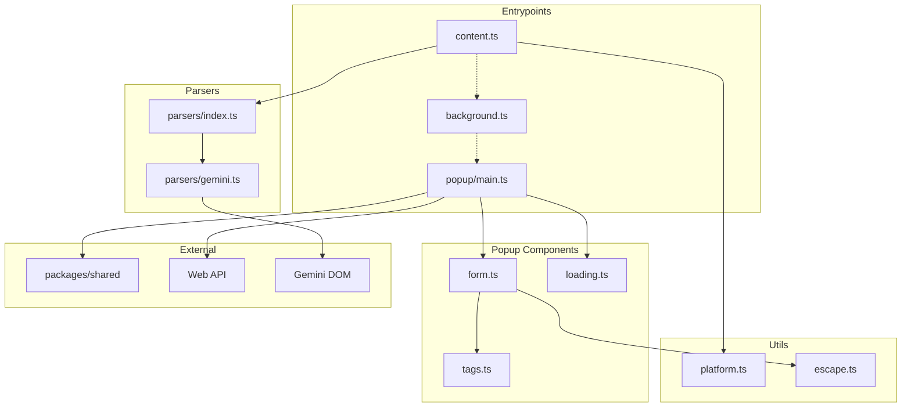
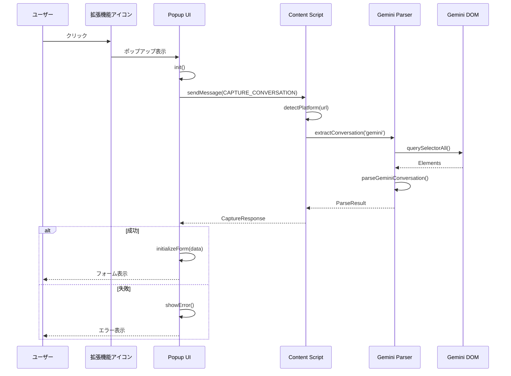
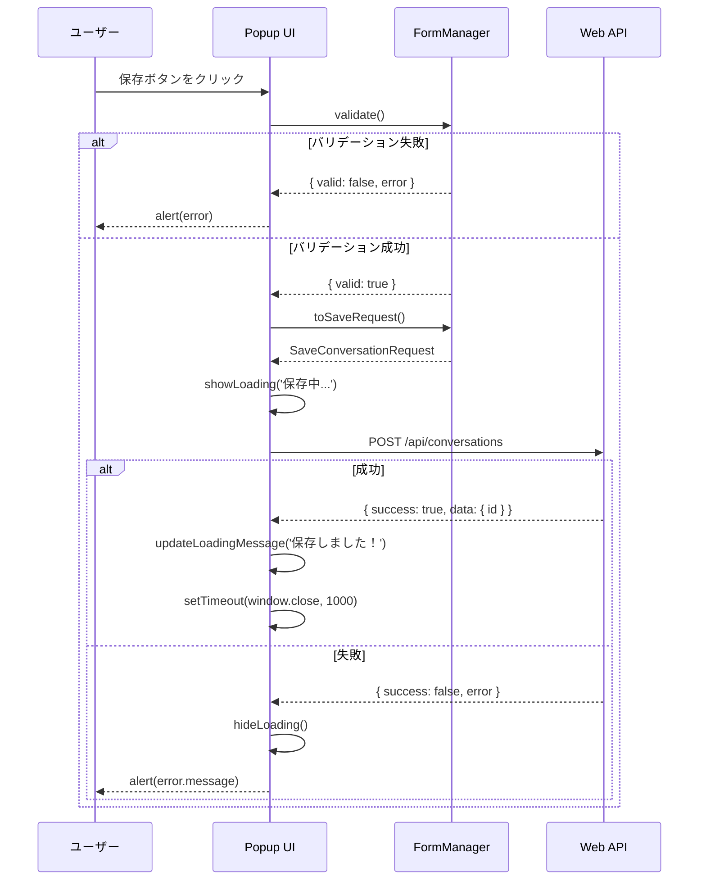

# Chrome拡張機能（apps/extension）

## 責務

- LLMサイト（Gemini等）のDOM解析による対話キャプチャ
- ポップアップUIでの対話編集（タイトル・メモ・タグ）
- Web APIへの対話保存リクエスト送信

## ディレクトリ構造

```
apps/extension/
├── entrypoints/                  # WXT エントリポイント
│   ├── content.ts               # Content Script（DOM解析）
│   ├── background.ts            # Background Script
│   └── popup/
│       ├── index.html           # ポップアップHTML
│       ├── main.ts              # ポップアップメイン
│       ├── style.css            # スタイル
│       ├── components/
│       │   ├── form.ts          # フォーム管理
│       │   ├── loading.ts       # ローディング表示
│       │   └── tags.ts          # タグ編集UI
│       └── utils/
│           └── escape.ts        # HTMLエスケープ
│
├── lib/
│   └── parsers/
│       ├── index.ts             # パーサーインターフェース
│       └── gemini.ts            # Gemini DOM解析
│
├── utils/
│   └── platform.ts              # プラットフォーム判定
│
├── public/
│   └── icon/                    # 拡張機能アイコン
│
├── wxt.config.ts                # WXT設定
└── package.json
```

## 公開インターフェース

### Content Script メッセージ

```typescript
// リクエスト
interface CaptureMessage {
  type: 'CAPTURE_CONVERSATION';
}

// レスポンス
interface CaptureResponse {
  success: boolean;
  platform: SourcePlatform | null;
  data?: ParseResult;
  error?: string;
}
```

### パーサーインターフェース

```typescript
// lib/parsers/index.ts
interface ConversationParser {
  parse(): ParseResult;
}

type ParseResult =
  | { success: true; messages: Message[]; title: string | null }
  | { success: false; error: string };
```

## 依存関係図



## 主要な処理フロー

### 対話キャプチャ



### 対話保存



## DOM解析セレクタ

### Gemini（gemini.ts）

```typescript
const GEMINI_SELECTORS = {
  conversationTurn: 'model-response, user-query',
  userQuery: 'user-query',
  modelResponse: 'model-response',
  messageContent: '.message-content, .response-content, [class*="text"]',
  pageTitle: 'title',
} as const;
```

**更新方法**: DOM構造が変更された場合、このオブジェクトのみを更新。
パーサーロジックは変更不要（OCP準拠）。

### プラットフォーム判定（platform.ts）

```typescript
const PLATFORM_URL_PATTERNS = [
  { platform: 'gemini', hostPatterns: [/^gemini\.google\.com$/] },
  { platform: 'chatgpt', hostPatterns: [/^chat\.openai\.com$/, /^chatgpt\.com$/] },
  { platform: 'claude', hostPatterns: [/^claude\.ai$/] },
] as const;
```

## 設計意図

### WXTの採用理由

- Manifest V3対応のデファクトスタンダード
- HMR（Hot Module Replacement）による高速開発
- TypeScriptネイティブサポート

### パーサーの抽象化

- `ConversationParser` インターフェースで統一
- プラットフォーム追加時に新規パーサーを追加するだけ
- 既存コード変更不要（OCP準拠）

### セキュリティ対策

- `escapeHtml()` でXSS対策
- `host_permissions` で許可ドメインを制限
- API Keyは拡張機能に含めない（サーバーサイドのみ）

## 実装状況

| プラットフォーム | 状態 | パーサー |
|-----------------|------|---------|
| Gemini | ✅ 実装済み | `gemini.ts` |
| ChatGPT | 🔲 計画中 | スタブ実装 |
| Claude | 🔲 計画中 | スタブ実装 |

## 次に読むべきドキュメント

- Webアプリケーション → [web.md](web.md)
- 共通型定義 → [shared.md](shared.md)
- API仕様 → [../api.md](../api.md)
