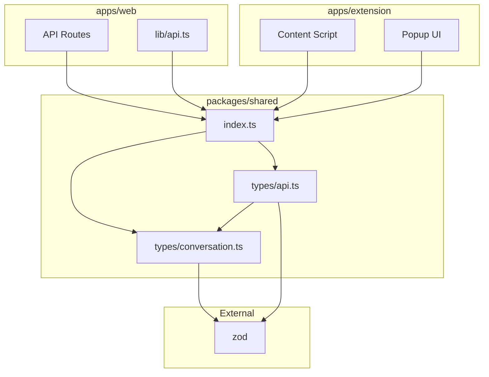

# 共通型定義（packages/shared）

## 責務

- Zodスキーマによる型定義とバリデーション
- 拡張機能↔Web API間の型安全性保証
- APIリクエスト/レスポンスの共通フォーマット定義

## ディレクトリ構造

```
packages/shared/
├── src/
│   ├── index.ts              # メインエクスポート
│   └── types/
│       ├── conversation.ts   # 対話関連型
│       └── api.ts            # API通信型
├── tsconfig.json
└── package.json
```

## 公開インターフェース

### 型エクスポート（index.ts）

```typescript
// 対話関連
export {
  MessageRoleSchema,
  MessageSchema,
  ConversationStatusSchema,
  SourcePlatformSchema,
  ConversationSchema,
  type MessageRole,
  type Message,
  type ConversationStatus,
  type SourcePlatform,
  type Conversation,
} from './types/conversation';

// API関連
export {
  ApiErrorSchema,
  ApiSuccessSchema,
  ApiFailureSchema,
  SaveConversationRequestSchema,
  SaveConversationResponseSchema,
  ListConversationsResponseSchema,
  GetConversationResponseSchema,
  type ApiError,
  type ApiFailure,
  type SaveConversationRequest,
  type SaveConversationResponse,
  type ListConversationsResponse,
  type GetConversationResponse,
} from './types/api';
```

## スキーマ定義

### conversation.ts

```typescript
import { z } from 'zod';

// メッセージの役割
export const MessageRoleSchema = z.enum(['user', 'assistant', 'system']);
export type MessageRole = z.infer<typeof MessageRoleSchema>;

// 単一メッセージ
export const MessageSchema = z.object({
  id: z.string(),
  role: MessageRoleSchema,
  content: z.string(),
  timestamp: z.string().datetime(),
});
export type Message = z.infer<typeof MessageSchema>;

// 対話ステータス
export const ConversationStatusSchema = z.enum(['active', 'archived', 'deleted']);
export type ConversationStatus = z.infer<typeof ConversationStatusSchema>;

// ソースプラットフォーム
export const SourcePlatformSchema = z.enum(['chatgpt', 'claude', 'gemini']);
export type SourcePlatform = z.infer<typeof SourcePlatformSchema>;

// 対話全体
export const ConversationSchema = z.object({
  id: z.string(),
  title: z.string(),
  source: SourcePlatformSchema,
  messages: z.array(MessageSchema),
  status: ConversationStatusSchema.default('active'),
  tags: z.array(z.string()).default([]),
  createdAt: z.string().datetime(),
  updatedAt: z.string().datetime(),
  note: z.string().optional(),
});
export type Conversation = z.infer<typeof ConversationSchema>;
```

### api.ts

```typescript
import { z } from 'zod';
import { ConversationSchema } from './conversation';

// エラー詳細
export const ApiErrorSchema = z.object({
  code: z.string(),
  message: z.string(),
  details: z.record(z.unknown()).optional(),
});
export type ApiError = z.infer<typeof ApiErrorSchema>;

// 成功レスポンス（ジェネリック）
export const ApiSuccessSchema = <T extends z.ZodTypeAny>(dataSchema: T) =>
  z.object({
    success: z.literal(true),
    data: dataSchema,
  });

// 失敗レスポンス
export const ApiFailureSchema = z.object({
  success: z.literal(false),
  error: ApiErrorSchema,
});
export type ApiFailure = z.infer<typeof ApiFailureSchema>;

// 対話保存リクエスト
export const SaveConversationRequestSchema = ConversationSchema.omit({
  id: true,
  status: true,
  createdAt: true,
  updatedAt: true,
});
export type SaveConversationRequest = z.infer<typeof SaveConversationRequestSchema>;

// 対話保存レスポンス
export const SaveConversationResponseSchema = ApiSuccessSchema(
  z.object({
    id: z.string(),
    createdAt: z.string().datetime(),
  })
);
export type SaveConversationResponse = z.infer<typeof SaveConversationResponseSchema>;

// 対話一覧レスポンス
export const ListConversationsResponseSchema = ApiSuccessSchema(
  z.object({
    conversations: z.array(ConversationSchema),
    nextCursor: z.string().optional(),
  })
);
export type ListConversationsResponse = z.infer<typeof ListConversationsResponseSchema>;

// 対話詳細レスポンス
export const GetConversationResponseSchema = ApiSuccessSchema(ConversationSchema);
export type GetConversationResponse = z.infer<typeof GetConversationResponseSchema>;
```

## 依存関係図



## 使用例

### Web API（バリデーション）

```typescript
// apps/web/src/app/api/conversations/route.ts
import { SaveConversationRequestSchema } from '@zenn-hackathon04/shared';

const parseResult = SaveConversationRequestSchema.safeParse(body);
if (!parseResult.success) {
  // バリデーションエラー処理
}
```

### 拡張機能（型の使用）

```typescript
// apps/extension/entrypoints/popup/main.ts
import type { Message, SourcePlatform } from '@zenn-hackathon04/shared';

const formData: ConversationFormData = {
  title: response.data.title ?? '無題の対話',
  source: response.platform!,  // SourcePlatform型
  messages: response.data.messages,  // Message[]型
  tags: [],
  note: '',
};
```

## 設計意図

### Zodの採用理由

- **ランタイムバリデーション**: APIリクエストを実行時に検証
- **型推論**: `z.infer<>` でTypeScript型を自動生成
- **エラー詳細**: `flatten()` で構造化されたエラー情報を取得

### パッケージ分離の理由

- **型安全性**: 拡張機能とWebアプリで同じ型定義を共有
- **DRY原則**: スキーマ定義の重複を排除
- **依存方向**: `shared` → `apps/*` の一方向依存

### スキーマ設計方針

- **厳密性**: `z.string().datetime()` で日時形式を強制
- **デフォルト値**: `status`, `tags` にデフォルトを設定
- **Optional明示**: `note` のみオプショナル

## 次に読むべきドキュメント

- Webアプリケーション → [web.md](web.md)
- Chrome拡張機能 → [extension.md](extension.md)
- データベース設計 → [../database.md](../database.md)
