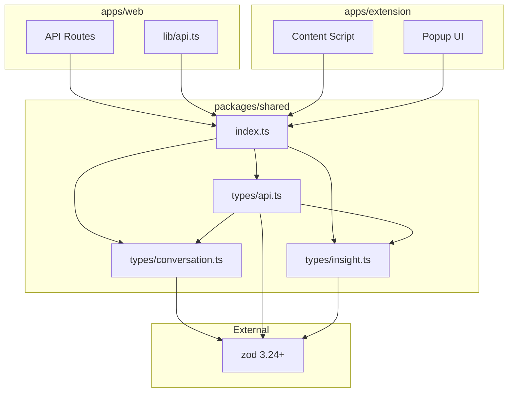

# 共通型定義（packages/shared）

## 責務

- Zodスキーマによる型定義とバリデーション
- 拡張機能↔Web API間の型安全性保証
- APIリクエスト/レスポンスの共通フォーマット定義

## ディレクトリ構造

```
packages/shared/
├── src/
│   ├── index.ts              # メインエクスポート
│   └── types/
│       ├── conversation.ts   # 対話関連型
│       ├── api.ts            # API通信型
│       └── insight.ts        # 洞察関連型（Sprint 2 追加）
├── tsconfig.json
└── package.json
```

## 公開インターフェース

### 型エクスポート（index.ts）

```typescript
// 対話関連
export * from './types/conversation';

// API関連
export * from './types/api';

// 洞察関連（Sprint 2 追加）
export * from './types/insight';
```

## スキーマ定義

### conversation.ts

| スキーマ | 型 | 説明 |
|---------|-----|------|
| `MessageRoleSchema` | `'user' \| 'assistant' \| 'system'` | メッセージの役割 |
| `MessageSchema` | `Message` | 単一メッセージ（id, role, content, timestamp） |
| `ConversationStatusSchema` | `'active' \| 'archived' \| 'deleted'` | 対話ステータス |
| `SourcePlatformSchema` | `'chatgpt' \| 'claude' \| 'gemini'` | ソースプラットフォーム |
| `ConversationSchema` | `Conversation` | 対話全体（messages埋め込み） |

### api.ts

| スキーマ | 型 | 説明 |
|---------|-----|------|
| `ApiErrorSchema` | `ApiError` | エラー詳細（code, message, details） |
| `ApiSuccessSchema<T>` | generic | 成功レスポンス共通 |
| `ApiFailureSchema` | `ApiFailure` | 失敗レスポンス共通 |
| `SaveConversationRequestSchema` | `SaveConversationRequest` | 対話保存リクエスト |
| `SaveConversationResponseSchema` | `SaveConversationResponse` | 対話保存レスポンス |
| `ListConversationsResponseSchema` | `ListConversationsResponse` | 対話一覧レスポンス |
| `GetConversationResponseSchema` | `GetConversationResponse` | 対話詳細レスポンス |
| `UpdateConversationRequestSchema` | `UpdateConversationRequest` | メモ更新リクエスト（Sprint 2） |
| `UpdateConversationResponseSchema` | `UpdateConversationResponse` | メモ更新レスポンス（Sprint 2） |
| `SaveInsightRequestSchema` | `SaveInsightRequest` | 洞察保存リクエスト（Sprint 2） |
| `SaveInsightResponseSchema` | `SaveInsightResponse` | 洞察保存レスポンス（Sprint 2） |
| `ListInsightsResponseSchema` | `ListInsightsResponse` | 洞察一覧レスポンス（Sprint 2） |

### insight.ts（Sprint 2 追加）

| スキーマ | 型 | 説明 |
|---------|-----|------|
| `InsightSchema` | `Insight` | 洞察（id, conversationId, question, answer, createdAt, updatedAt） |

## 依存関係図



## 設計意図

### Zodの採用理由

- **ランタイムバリデーション**: APIリクエストを実行時に検証
- **型推論**: `z.infer<>` でTypeScript型を自動生成
- **エラー詳細**: `flatten()` で構造化されたエラー情報を取得

### パッケージ分離の理由

- **型安全性**: 拡張機能とWebアプリで同じ型定義を共有
- **DRY原則**: スキーマ定義の重複を排除
- **依存方向**: `shared` → `apps/*` の一方向依存

## JSDoc充足状況

| ファイル | 状態 | 備考 |
|---------|------|------|
| `types/conversation.ts` | ✅ 充実 | `@fileoverview` + スキーマ・型定義にコメント |
| `types/api.ts` | ✅ 充実 | `@fileoverview` + スキーマ・型定義にコメント |
| `types/insight.ts` | ✅ 充実 | `@fileoverview` + スキーマ・型定義にコメント |

全ファイルのJSDocは充実しており、追加作業なし。

## 次に読むべきドキュメント

- Webアプリケーション → [web.md](web.md)
- Chrome拡張機能 → [extension.md](extension.md)
- データベース設計 → [../database.md](../database.md)
