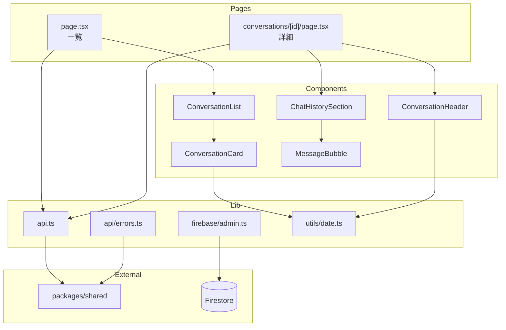
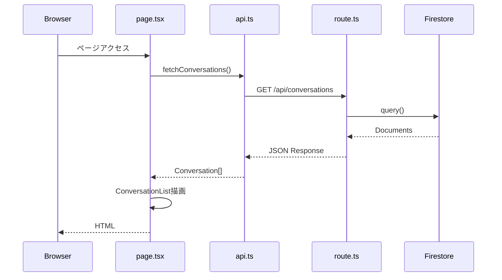
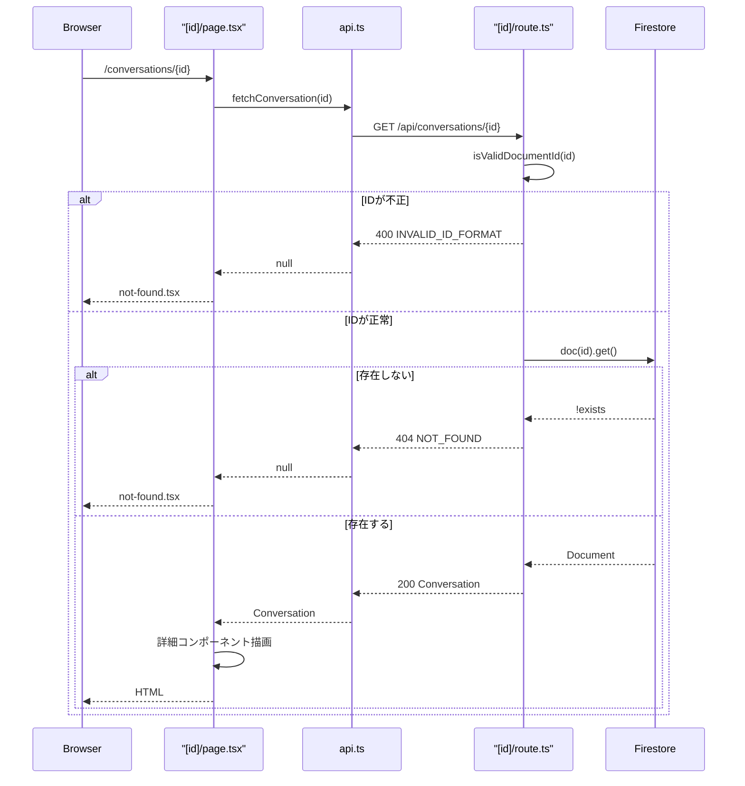

# Webアプリケーション（apps/web）

## 責務

- 対話の一覧・詳細表示（管理画面UI）
- REST APIエンドポイントの提供（対話の保存・取得）
- Firestoreとの通信

## ディレクトリ構造

```
apps/web/src/
├── app/                          # Next.js App Router
│   ├── layout.tsx               # ルートレイアウト
│   ├── page.tsx                 # 対話一覧ページ
│   ├── globals.css              # グローバルスタイル
│   ├── conversations/
│   │   └── [id]/
│   │       ├── page.tsx         # 対話詳細ページ
│   │       └── not-found.tsx    # 404ページ
│   └── api/
│       └── conversations/
│           ├── route.ts         # POST, GET
│           └── [id]/
│               └── route.ts     # GET :id
│
├── components/
│   ├── layout/                  # レイアウトコンポーネント
│   │   ├── Header.tsx
│   │   ├── Sidebar.tsx
│   │   └── index.ts
│   └── conversations/           # 対話表示コンポーネント
│       ├── ConversationList.tsx
│       ├── ConversationCard.tsx
│       ├── ConversationHeader.tsx
│       ├── ChatHistorySection.tsx
│       ├── MessageList.tsx
│       ├── MessageBubble.tsx
│       ├── SourceBadge.tsx
│       ├── InsightSection.tsx
│       ├── NoteSection.tsx
│       ├── ThinkResumePanel.tsx
│       └── index.ts
│
└── lib/
    ├── api.ts                   # APIクライアント
    ├── api/
    │   └── errors.ts            # エラーハンドリング
    ├── firebase/
    │   └── admin.ts             # Firebase Admin SDK
    └── utils/
        └── date.ts              # 日付ユーティリティ
```

## 公開インターフェース

### API Routes

| エンドポイント | メソッド | ハンドラ |
|---------------|---------|---------|
| `/api/conversations` | POST | `route.ts#POST` |
| `/api/conversations` | GET | `route.ts#GET` |
| `/api/conversations/:id` | GET | `[id]/route.ts#GET` |

### クライアントAPI

```typescript
// lib/api.ts
export async function fetchConversations(): Promise<Conversation[]>
export async function fetchConversation(id: string): Promise<Conversation | null>
```

## 依存関係図



## 主要な処理フロー

### 対話一覧表示



### 対話詳細表示



## 設計意図

### Server Components の活用

- `page.tsx` はServer Componentとして実装
- データフェッチはサーバーサイドで完結（SEO、初期表示速度向上）
- インタラクティブなUIは将来Client Componentに分離予定

### コンポーネント分割方針

- **単一責務**: 各コンポーネントは1つの役割に集中
- **再利用性**: `SourceBadge`, `MessageBubble` は複数箇所で使用
- **テスト容易性**: Propsベースでデータ注入

### エラーハンドリング

- `createServerErrorResponse()` でエラー処理を共通化
- Firebase未設定エラーを専用コードで識別
- 内部エラー詳細はログのみ、クライアントには汎用メッセージ

## 次に読むべきドキュメント

- Chrome拡張機能 → [extension.md](extension.md)
- 共通型定義 → [shared.md](shared.md)
- API仕様 → [../api.md](../api.md)
