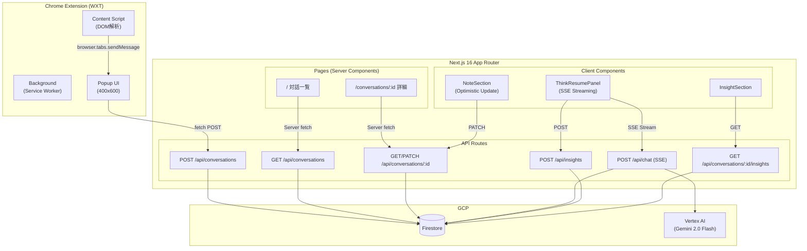

# システム概要

## 背景（Background）

LLMとの対話は使い捨てになりがちで、重要な洞察や議論を保存・再利用できない課題がある。
エンジニア、リサーチャー、LLMヘビーユーザーにとって、価値ある対話を資産化し、
後から思考を継続できる仕組みが求められている。

## 目標（Goals）

1. **対話キャプチャ**: ChatGPT/Claude/GeminiのDOM構造から対話を取得
2. **対話保存**: Chrome拡張からFirestoreに対話を永続化
3. **対話閲覧**: Web管理画面で保存済み対話を一覧・詳細表示
4. **思考再開**: 保存した対話をGeminiに渡して思考を継続（✅ Sprint 2で実装済み）
5. **洞察蓄積**: Geminiとの対話からQ&A形式で重要な洞察を保存（✅ Sprint 2で実装済み）
6. **メモ編集**: 対話へのメモ追記・編集（Optimistic Update対応、✅ Sprint 2で実装済み）

## 非目標（Non-Goals）

- マルチユーザー対応
- 高度な検索・フィルタ機能（Sprint 3予定）
- スペース機能（Sprint 3予定）
- モバイルアプリ
- Firefox拡張

## システム構成図

## 主要な技術スタック

| 領域 | 技術 | バージョン |
|------|------|-----------|
| モノレポ | pnpm workspaces | 9+ |
| Web | Next.js (App Router) | 16.1.6 |
| UI | React | 19.2.3 |
| 拡張機能 | WXT (Manifest V3) | 0.20.6 |
| 共通型定義 | Zod | 3.24+ |
| スタイル | Tailwind CSS | v4 |
| アイコン | lucide-react | 0.563.0 |
| Markdown | react-markdown | 10.1.0 |
| AI | Vertex AI (Gemini 2.0 Flash) | @google-cloud/vertexai 1.10+ |
| DB | Firestore (firebase-admin) | 13.6+ |
| ランタイム | Node.js | 20+ |
| 言語 | TypeScript | 5.9+ |

## Sprint 2 で追加された機能

| 機能 | 概要 | 関連コンポーネント |
|------|------|-------------------|
| 思考再開チャット | 保存した対話をコンテキストにGeminiとストリーミング対話 | ThinkResumePanel, POST /api/chat |
| 洞察保存 | Geminiの回答をQ&Aペアで保存 | InsightSection, POST /api/insights |
| メモ編集 | Optimistic Update対応のメモ追記・編集 | NoteSection, PATCH /api/conversations/:id |
| 未保存警告 | ページ離脱時のconfirmダイアログ（3層ガード） | useUnsavedChangesWarning |
| エラーハンドリング統一 | createClientErrorResponse/createServerErrorResponse | lib/api/errors.ts |

## 次に読むべきドキュメント

- 設計判断の詳細 → [architecture.md](architecture.md)
- データ構造 → [database.md](database.md)
- APIインターフェース → [api.md](api.md)
