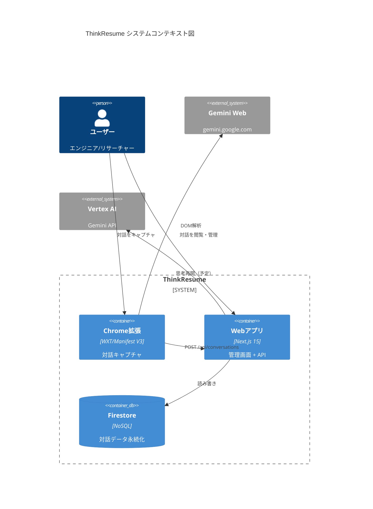
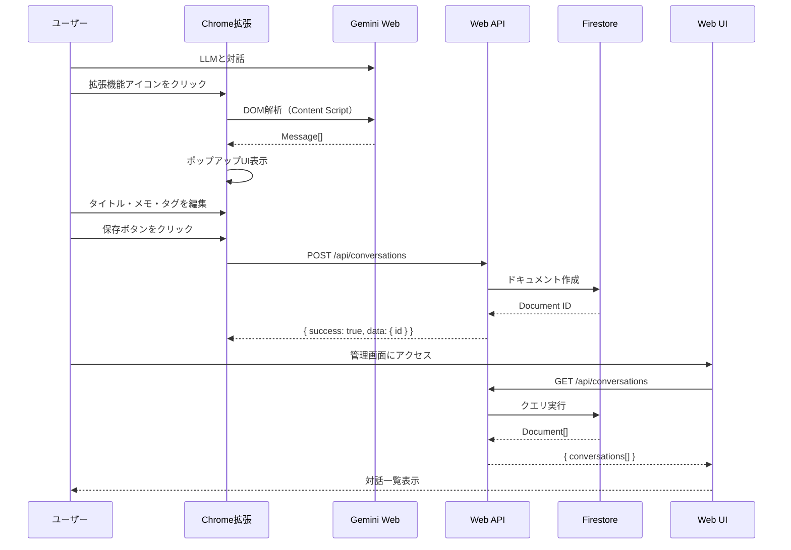

# システム概要

## 背景（Background）

LLMとの対話は使い捨てになりがちで、重要な洞察や議論を保存・再利用できない課題がある。
エンジニア、リサーチャー、LLMヘビーユーザーにとって、価値ある対話を資産化し、
後から思考を継続できる仕組みが求められている。

## 目標（Goals）

1. **対話キャプチャ**: ChatGPT/Claude/GeminiのDOM構造から対話を取得
2. **対話保存**: Chrome拡張からFirestoreに対話を永続化
3. **対話閲覧**: Web管理画面で保存済み対話を一覧・詳細表示
4. **思考再開**: 保存した対話をGeminiに渡して思考を継続（Sprint 2予定）

## 非目標（Non-Goals）

- マルチユーザー対応
- 高度な検索・フィルタ機能
- モバイルアプリ
- Firefox拡張

## システム構成図

## データフロー

## 主要な技術スタック

| 領域 | 技術 | バージョン |
|------|------|-----------|
| モノレポ | pnpm workspaces | 9+ |
| Web | Next.js App Router | 15 |
| 拡張機能 | WXT (Manifest V3) | 0.20+ |
| 共通型定義 | Zod | 3.24+ |
| スタイル | Tailwind CSS | v4 |
| DB | Firestore | - |
| AI | Vertex AI (Gemini) | - |
| ランタイム | Node.js | 20+ |

## 次に読むべきドキュメント

- 設計判断の詳細 → [architecture.md](architecture.md)
- データ構造 → [database.md](database.md)
- APIインターフェース → [api.md](api.md)
